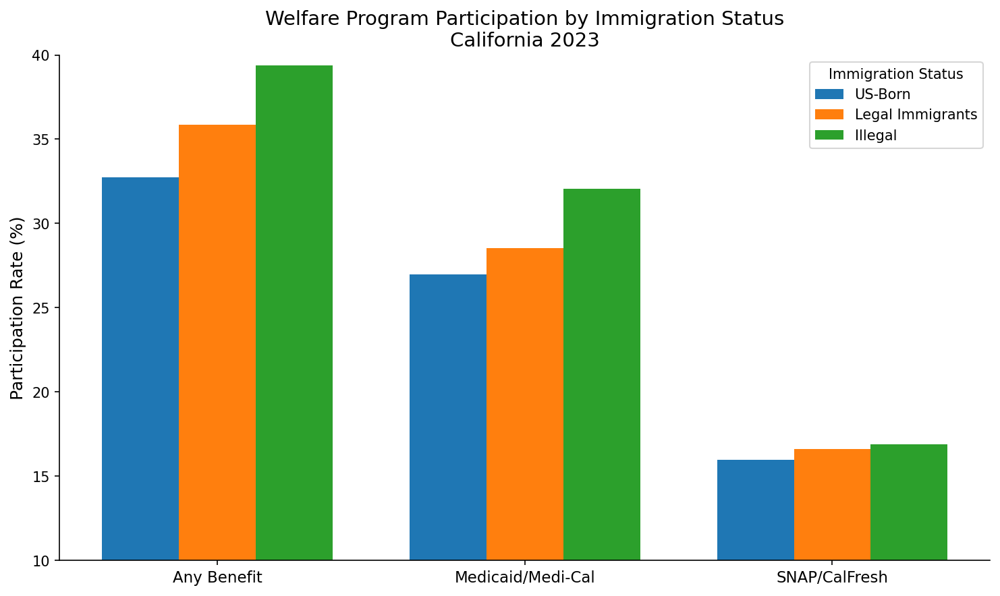

# California Welfare Participation by Immigration Status

A reproducible analysis estimating welfare program participation rates in California by immigration status, using publicly available Census data with statistical imputation for illegal immigrant identification.

## Key Findings



### Participation Rates (California 2023)

| Program | US-Born | Legal Immigrants | Illegal Immigrants |
|---------|:-------:|:----------------:|:------------------:|
| **Any Benefit** | 32.7% | 35.8% | 39.4% |
| **Medicaid/Medi-Cal** | 27.0% | 28.5% | 32.1% |
| **SNAP/CalFresh** | 16.0% | 16.6% | 16.9% |
| SSI | 2.1% | 3.4% | 1.2%* |
| Public Assistance | 1.4% | 1.7% | 1.5%* |
| Any Cash Benefit | 3.4% | 4.9% | 2.7%* |

*\*Estimates with higher uncertainty due to smaller sample sizes*

### Population Estimates

| Group | Population |
|-------|----------:|
| US-Born | 28.3 million |
| Legal Immigrants | 10.6 million |
| Illegal Immigrants | 2.2 million |

**Source:** 2023 American Community Survey with SIPP-based status imputation, calibrated to Pew Research unauthorized population estimates.

---

## Overview

This project estimates welfare program participation rates by immigration status in California. The key methodological challenge is that **no public survey directly identifies illegal immigrant status**. We address this using:

1. **SIPP-based classification model** trained on Survey of Income and Program Participation data (which contains partial legal status information)
2. **Multiple imputation** applied to ACS noncitizens to probabilistically assign legal vs. illegal status
3. **Calibration** to Pew Research Center's state-level unauthorized population estimates (~2.2 million in California)
4. **Rubin's rules** to properly combine estimates across imputations and account for imputation uncertainty

## Data Sources

| Dataset | Source | Purpose |
|---------|--------|---------|
| **ACS PUMS 2023** | U.S. Census Bureau | Main analysis microdata (welfare receipt, demographics) |
| **SIPP 2022-2024** | U.S. Census Bureau | Training data for legal status imputation model |
| **Pew Research** | Pew Research Center | Calibration benchmarks for unauthorized population |
| **CHIS 2023** | UCLA | Cross-validation (see below) |

## Methodology

### Status Imputation Pipeline

```
┌─────────────────┐     ┌──────────────────┐     ┌─────────────────┐
│  SIPP Data      │────▶│ Train Status     │────▶│ Classification  │
│  (has legal     │     │ Model (XGBoost)  │     │ Model           │
│   status info)  │     └──────────────────┘     └────────┬────────┘
└─────────────────┘                                       │
                                                          ▼
┌─────────────────┐     ┌──────────────────┐     ┌─────────────────┐
│  ACS PUMS       │────▶│ Apply Model to   │────▶│ P(illegal|X)    │
│  (noncitizens)  │     │ Noncitizens      │     │ for each person │
└─────────────────┘     └──────────────────┘     └────────┬────────┘
                                                          │
                        ┌──────────────────┐              │
                        │ Pew Unauthorized │              │
                        │ Estimates (~2.2M)│──────────────┤
                        └──────────────────┘              │
                                                          ▼
                        ┌──────────────────┐     ┌─────────────────┐
                        │ Multiple Imputed │◀────│ Calibrated      │
                        │ Datasets (M=10)  │     │ Bernoulli Draws │
                        └────────┬─────────┘     └─────────────────┘
                                 │
                                 ▼
                        ┌──────────────────┐
                        │ Rubin's Rules    │
                        │ Combined Results │
                        └──────────────────┘
```

### Uncertainty Quantification

Two sources of uncertainty are properly combined:

1. **Survey sampling variance**: Estimated using ACS successive difference replication (SDR) with 80 replicate weights
2. **Imputation variance**: Between-imputation variance captured via Rubin's rules across 10 imputed datasets

### CHIS Cross-Validation

We validated our ACS-based estimates against the California Health Interview Survey (CHIS) 2023, an independent survey with citizenship questions:

| Group | CHIS Medi-Cal | ACS Medicaid | Difference |
|-------|:-------------:|:------------:|:----------:|
| US-Born | 24.1% | 27.0% | -2.9pp |
| Naturalized | 28.1% | 28.5% | -0.4pp |
| Non-citizen | 5.9% | 28-32% | Large gap |

**Key findings from validation:**
- US-born and naturalized rates align well between surveys (within 3 percentage points)
- CHIS non-citizen Medi-Cal rate (5.9%) is much lower than ACS illegal estimate (32.1%)
  - CHIS likely captures only full-scope Medi-Cal, not emergency/restricted coverage
  - CHIS cannot distinguish legal vs. illegal non-citizens
- **Conclusion:** ACS-based imputed estimates are preferred for this analysis

## Immigration Status Definitions

| Group | Definition |
|-------|------------|
| **US_BORN** | Born in the United States (citizen at birth) |
| **LEGAL_IMMIGRANT** | Foreign-born, legally present (naturalized citizens + lawful permanent residents + visa holders + refugees) |
| **ILLEGAL** | Foreign-born noncitizen without legal authorization (statistically imputed) |

## Programs Analyzed

| Program | ACS Variable | Description |
|---------|--------------|-------------|
| **Medicaid/Medi-Cal** | HINS4 | Public health insurance coverage |
| **SNAP/CalFresh** | FS | Food assistance (household level, past 12 months) |
| **SSI** | SSIP | Supplemental Security Income |
| **Public Assistance** | PAP | Cash welfare income (TANF/CalWORKs proxy) |

## Quick Start

### Prerequisites

- Python 3.11+
- ~500MB disk space for data

### Installation

```bash
git clone https://github.com/kevinnbass/ca_welfare_immigrants.git
cd ca_welfare_immigrants
pip install -r requirements.txt
```

### Running the Analysis

```bash
# Full pipeline (downloads data, trains model, estimates rates)
python -m src.run_all --year 2023

# Or run individual steps
python -m src.00_fetch_data          # Download ACS, SIPP, Pew data
python -m src.01_clean_acs           # Clean and prepare ACS
python -m src.02_train_status_model  # Train SIPP-based model
python -m src.03_impute_status_acs   # Apply imputation to ACS
python -m src.04_estimate_rates      # Compute welfare rates
python -m src.05_report              # Generate figures and report

# Optional: Cross-validate against CHIS (requires manual CHIS download)
python -m src.07_validate_chis
```

## Output Files

| File | Description |
|------|-------------|
| `outputs/figures/participation_comparison_2023.png` | Main results visualization |
| `outputs/tables/ca_rates_by_group_program_2023_imputed.csv` | Detailed rate estimates with SEs |
| `outputs/tables/ca_population_by_group_2023.csv` | Population counts by status |
| `outputs/tables/chis_validation_2023.csv` | CHIS validation results |
| `reports/ca_welfare_by_immigration_status_2023.md` | Full methodology report |

## Limitations

1. **Imputation uncertainty**: Legal status is statistically imputed, not observed. Illegal immigrant estimates have higher uncertainty than other groups.

2. **Survey underreporting**: ACS welfare receipt questions systematically underestimate true participation. Research indicates ACS captures ~60-70% of administrative SNAP totals.

3. **Receipt vs. eligibility**: This analysis measures program receipt, not eligibility. Many eligible individuals do not participate due to administrative barriers, lack of awareness, or fear of immigration consequences.

4. **Mixed-status households**: Households containing both legal and illegal members complicate individual-level classification. Benefits received by US-citizen children in illegal immigrant households are attributed to the household.

5. **Model transfer assumptions**: The SIPP-to-ACS model transfer assumes covariate-status relationships are stable across surveys.

## Repository Structure

```
ca_welfare_immigrants/
├── src/                    # Python source code
│   ├── 00_fetch_data.py   # Data download
│   ├── 01_clean_acs.py    # ACS preparation
│   ├── 02_train_status_model.py  # SIPP model training
│   ├── 03_impute_status_acs.py   # Status imputation
│   ├── 04_estimate_rates.py      # Rate estimation
│   ├── 05_report.py              # Report generation
│   └── 07_validate_chis.py       # CHIS validation
├── outputs/
│   ├── figures/           # Generated visualizations
│   └── tables/            # CSV results
├── data/                  # Data files (gitignored)
├── models/                # Trained models
└── reports/               # Generated reports
```

## Citation

If you use this analysis, please cite the underlying data sources:

- U.S. Census Bureau. American Community Survey Public Use Microdata Sample, 2023.
- U.S. Census Bureau. Survey of Income and Program Participation, 2022-2024.
- Pew Research Center. "Unauthorized Immigrant Population Estimates." 2024.
- UCLA Center for Health Policy Research. California Health Interview Survey, 2023.

## License

This project uses only publicly available data. See individual data source terms of use.
