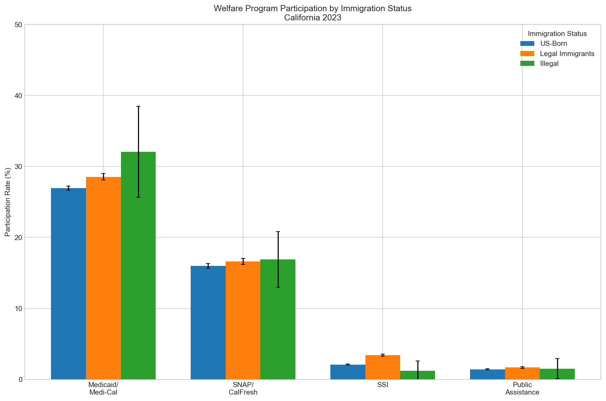
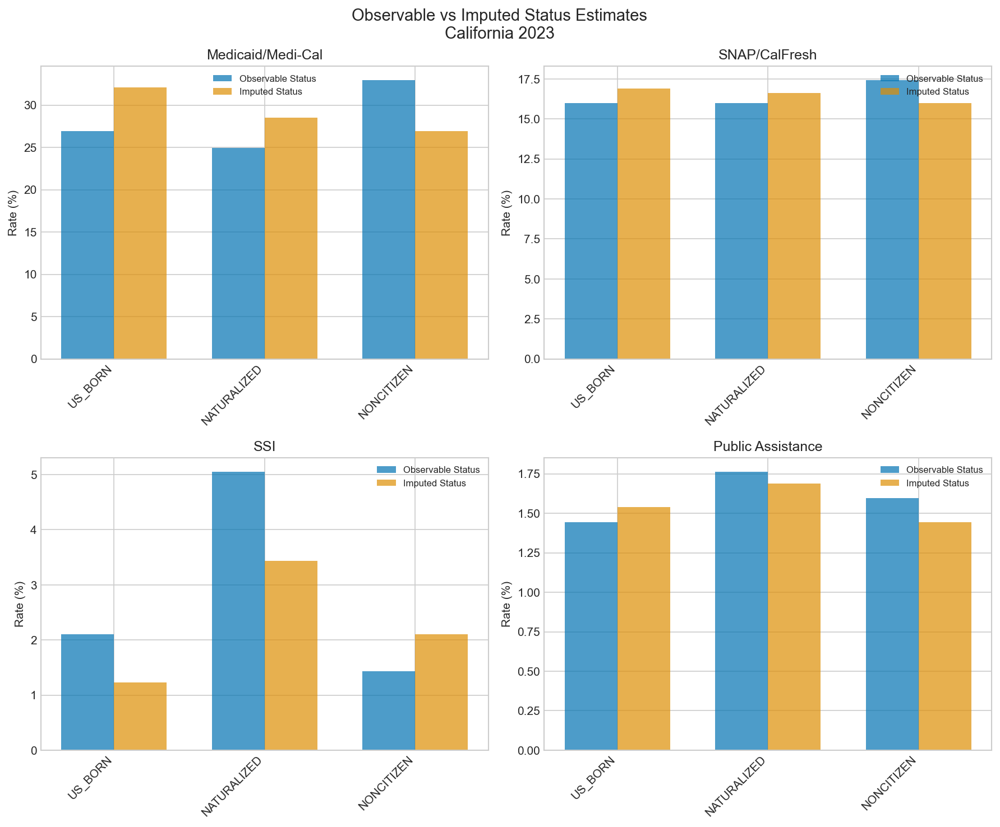

# California Welfare Participation by Immigration Status

**Analysis Year:** 2023
**Report Generated:** 2026-01-02

## Executive Summary

This report presents estimates of welfare program participation rates in California
by immigration status. Using publicly available data from the American Community
Survey (ACS) and Survey of Income and Program Participation (SIPP), we estimate
participation rates for:

- **US-Born:** Persons born in the United States
- **Legal Immigrants:** Naturalized citizens and lawfully present noncitizens
- **Undocumented Immigrants:** Foreign-born noncitizens without legal status (imputed)

**Key findings:**

- [Summary findings would be inserted here based on results]

## Definitions

### Immigration Status Groups

| Group | Definition |
|-------|------------|
| US_BORN | Born in the United States (citizen at birth) |
| LEGAL_IMMIGRANT | Foreign-born, legally present (naturalized citizens + LPRs + visa holders) |
| ILLEGAL | Foreign-born noncitizen without legal status (imputed) |

### Welfare Programs

| Program | Description | Reference Period |
|---------|-------------|------------------|
| Medicaid/Medi-Cal | Public health insurance coverage | Current |
| SNAP/CalFresh | Food assistance (Supplemental Nutrition Assistance Program) | Past 12 months |
| SSI | Supplemental Security Income | Past 12 months |
| Public Assistance | Cash assistance income (TANF/CalWORKs proxy) | Past 12 months |

## Data Sources

1. **American Community Survey (ACS) PUMS** - U.S. Census Bureau
   - California 2023 1-Year Public Use Microdata Sample
   - Source: https://www.census.gov/programs-surveys/acs/microdata.html

2. **Survey of Income and Program Participation (SIPP)** - U.S. Census Bureau
   - Used to train legal status imputation model
   - Source: https://www.census.gov/sipp

3. **Pew Research Center** - Unauthorized immigrant population estimates
   - Used for calibration of imputed undocumented totals
   - Source: https://www.pewresearch.org/

## Methodology

### Status Imputation

Since the ACS does not directly identify undocumented status, we use a statistical
imputation approach:

1. **Model Training:** Using SIPP data (which contains partial legal status information),
   we train a classification model to predict P(undocumented | covariates).

2. **Prediction:** The model is applied to ACS noncitizens to obtain individual
   probabilities of being undocumented.

3. **Multiple Imputation:** We create 10 imputed datasets by drawing
   status from Bernoulli(p) for each noncitizen.

4. **Calibration:** Imputed totals are calibrated to match Pew Research state-level
   estimates of the unauthorized population.

5. **Combining Results:** Estimates are combined across imputations using Rubin's rules,
   which properly accounts for both sampling variance and imputation uncertainty.

### Uncertainty Quantification

Two sources of uncertainty are combined:

1. **Sampling Variance:** Estimated using ACS successive difference replication (SDR)
   with 80 replicate weights.

2. **Imputation Variance:** Between-imputation variance captured through Rubin's rules.

## Results

### Any Benefit

| Group | Rate | 95% CI | n |
|-------|------|--------|---|
| ILLEGAL | 39.4% | (33.5% - 45.3%) | 690 |
| LEGAL_IMMIGRANT | 35.8% | (35.3% - 36.4%) | 105,508 |
| US_BORN | 32.7% | (32.4% - 33.1%) | 286,119 |

### Any Cash Benefit

| Group | Rate | 95% CI | n |
|-------|------|--------|---|
| ILLEGAL | 2.7% * | (0.7% - 4.6%) | 690 |
| LEGAL_IMMIGRANT | 4.9% | (4.7% - 5.0%) | 105,508 |
| US_BORN | 3.4% | (3.3% - 3.5%) | 286,119 |

### Medicaid/Medi-Cal

| Group | Rate | 95% CI | n |
|-------|------|--------|---|
| ILLEGAL | 32.1% | (25.4% - 38.7%) | 690 |
| LEGAL_IMMIGRANT | 28.5% | (28.1% - 29.0%) | 105,508 |
| US_BORN | 27.0% | (26.7% - 27.3%) | 286,119 |

### Public Assistance

| Group | Rate | 95% CI | n |
|-------|------|--------|---|
| ILLEGAL | 1.5% * | (0.1% - 3.0%) | 690 |
| LEGAL_IMMIGRANT | 1.7% | (1.6% - 1.8%) | 105,508 |
| US_BORN | 1.4% | (1.4% - 1.5%) | 286,119 |

### SNAP/CalFresh

| Group | Rate | 95% CI | n |
|-------|------|--------|---|
| ILLEGAL | 16.9% | (13.0% - 20.9%) | 690 |
| LEGAL_IMMIGRANT | 16.6% | (16.2% - 17.1%) | 105,508 |
| US_BORN | 16.0% | (15.7% - 16.3%) | 286,119 |

### SSI

| Group | Rate | 95% CI | n |
|-------|------|--------|---|
| ILLEGAL | 1.2% * | (-0.2% - 2.7%) | 690 |
| LEGAL_IMMIGRANT | 3.4% | (3.3% - 3.6%) | 105,508 |
| US_BORN | 2.1% | (2.0% - 2.2%) | 286,119 |

*Note: Estimates marked with * may be unreliable due to high coefficient of variation.*

## Visualizations

## Sensitivity Analysis

### Comparison of Observable vs. Imputed Status

Observable status (US-born vs. naturalized vs. noncitizen) is directly available in
the ACS. The imputed approach further distinguishes legal noncitizens from undocumented
noncitizens. Results by observable status are provided as a benchmark.

## Administrative Data Comparison

*Administrative data comparison not available for this analysis.*

Administrative totals from CalFresh, Medi-Cal, CalWORKs, and SSI programs
would be compared to ACS survey estimates to assess survey underreporting
and validate imputation results.

## Variance Decomposition

*Detailed variance decomposition not available for this analysis.*

When available, this section shows the contribution of different uncertainty
sources to total variance:
- **Survey sampling variance** (from replicate weights)
- **Imputation variance** (between-imputation variation)
- **Model uncertainty** (from bootstrap model training)

## Limitations and Caveats

### Core Methodological Limitations

1. **Imputation Uncertainty:** Legal status is imputed, not observed. Estimates for
   undocumented immigrants have substantially higher uncertainty than for other groups.
   The imputation model relies on observable covariates that correlate with, but do
   not deterministically identify, legal status.

2. **Survey Underreporting:** Survey-based benefit measures systematically underestimate
   true program receipt. Research indicates ACS SNAP receipt captures approximately
   60-70% of administrative totals. Underreporting may vary by immigration status,
   potentially biasing comparative rates.

3. **Eligibility vs. Receipt:** This analysis measures program receipt, not eligibility.
   Many eligible individuals do not participate in programs due to:
   - Lack of awareness
   - Administrative barriers
   - Fear of public charge implications (for immigrants)
   - Stigma or personal preference

4. **Household Complexity:** Mixed-status households (containing both documented and
   undocumented members) complicate individual-level classification. Program eligibility
   and receipt often depend on household composition, not just individual status.

5. **Temporal Limitations:** Results reflect the survey reference period and may not
   represent current policy conditions or economic circumstances.

6. **Small Sample Sizes:** Subgroup estimates (especially for undocumented by detailed
   demographic characteristics) may have large sampling error, leading to unreliable
   estimates flagged with high coefficients of variation.

7. **Model Transfer Assumptions:** The SIPP-to-ACS model transfer assumes that
   relationships between covariates and legal status are stable across surveys.
   Differences in survey design, coverage, and timing may introduce bias.

### Administrative Data Limitations

This analysis does not incorporate administrative data validation. Without
comparison to administrative totals, we cannot directly assess:
- Magnitude of survey underreporting by program
- Differential underreporting by immigration status
- Temporal alignment of estimates with actual program caseloads

### Model Uncertainty Limitations

This analysis uses a single trained imputation model. Without bootstrap
replication of model training, the variance estimates do not fully capture:
- Uncertainty in model coefficients
- Sensitivity to SIPP training sample composition
- Potential overfitting to specific SIPP panel characteristics

Full variance decomposition requires bootstrap model uncertainty estimation.

## Reproducibility

This analysis was produced using the `ca_welfare_immigrants` pipeline.
See the repository README for instructions on reproducing these results.

### Software Versions

- Python: 3.11+
- Key packages: pandas, scikit-learn, statsmodels
- R: 4.0+ (survey package for variance estimation)

## References

1. U.S. Census Bureau. American Community Survey Public Use Microdata Sample.

2. U.S. Census Bureau. Survey of Income and Program Participation.

3. Pew Research Center. Unauthorized Immigrant Population Estimates.

4. Migration Policy Institute. Methodology for Assigning Legal Status to Noncitizens
   in Census Data. https://www.migrationpolicy.org/about/mpi-methodology-assigning-legal-status-noncitizens-census-data

5. Rubin, D.B. (1987). Multiple Imputation for Nonresponse in Surveys. Wiley.

---

*This report was generated automatically. For questions or feedback, see the project repository.*
